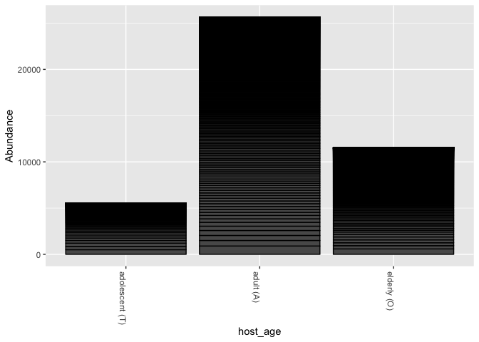
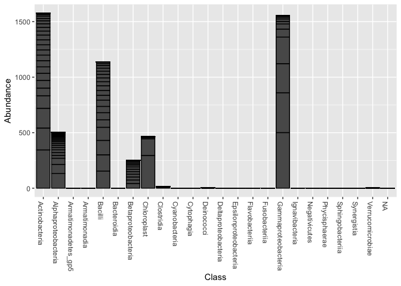
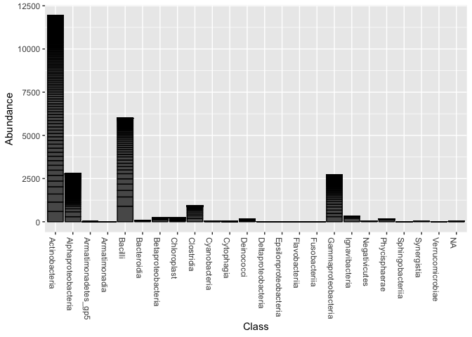
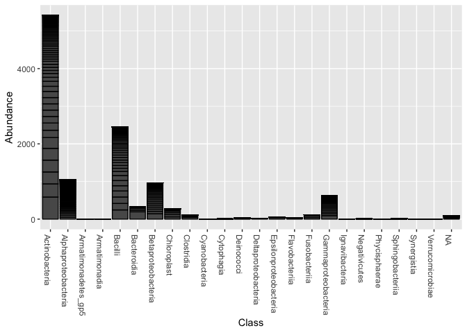

Introduction
============

The main purpose of this report is to explore how the data collected by Ying et al. can be used to investigate the relationship between the skin microbiome and aging.(<span class="citeproc-not-found" data-reference-id="ying2015influence:1">**???**</span>) It is important to understand the relationship between aging and human skin microbiome because this understanding can lay the foundation for creation of novel therapeutics that could slow down aging. This represents a paradigm shift for medicine in which our relationship with microbes is viewed as a symbiosis instead of a potential source for clinical infectious disease(Sleator, 2010).

Several studies have been done in C. elegans., a model organism, to find out relationships between the microbiome and aging. For instance, it has been shown that E. coli that co-exist with the worms secrete diffusible molecules, including metabolites and small RNAs that can impact C. elegans aging. (Heintz and Mair, 2014) Another study has revealed how drug action on host-microbiome interactions can impact longevity in C. elegans Metformin ( a drug widely prescribed to treat Diabetes) extends lifespan in C. elegans by inhibiting l-folate and methionine metabolism in E. coli. This, in turn, leads to altered methionine metabolism in the worm, and increased lifespan(Cabreiro *et al.*, 2013).

In addition, several studies done in humans reveal interesting information about how different age groups host different kind of Microbiome. For example, it has been shown that human skin microbiome shifts significantly in puberty specially(Oh *et al.*, 2012). Another study demonstrates changes in microbiome diversity related to age(Ying *et al.*, 2015). In addition, a study has shown a certain bacterium added to the skin can help keep the skin younger (Dimarzio *et al.*, 2008)).

It is worthwhile to note here the recent advances in mirobiome research has been in part made possible through novel DNA sequencing methodology. Considering that it there are about 100 trillion bacteria associated with humans that outnumber our human cells by a factor of ten(Huttenhower *et al.*, 2012),(Grice and Segre, 2011), it is important to apply these novel methods to identify bacterial sequences with accuracy and precision. A common approach used to identify bacterial populations is based on sequencing of the small subunit bacterial 16S ribosomal RNA (rRNA) gene. 16S ribosomal RNA (rRNA) gene is present in all bacteria and archaea but not in eukaryotes. The 16S rRNA gene has variable regions, used for taxonomic classification, and conserved regions, as binding sites for PCR primers. Importantly, an organism does not need to be cultured to determine its type by 16S rRNA sequencing. Hypervariable regions within this gene contain species-specific sequences, that when compared to reference databases, allow identification of the bacteria of origin.(Lane *et al.*, 1985),(Dethlefsen *et al.*, 2008).

Methods
=======

Study design
------------

The authors of the paper recruited a total of 71 subjects for the study, 36 living in the urban regions and 35 living in the rural regions of Shanghai, China.This study was approved by the Ethical Committee of Fudan University. A written informed consent was obtained from each subject or their guardians prior to sample collection. All data were de-identified. There were several criteria that needed to be met. For example, no subjects lived in the same family or worked in the same office. Subjects with any history of dermatologic diseases and those who had any antibiotic exposure in the past 6 months were excluded. Each subject was instructed not to wash the specific body sites for 12 hours (except hands for 2 hours) prior to sampling. Seven skin sites were sampled on each subject in order: back of hands (Hb), interdigital web space (Is), volar forearm (Vf), antecubital fossa (Af), nares (Na), glabella (Gb) and back (Ba).

Sample origin and sequencing
----------------------------

The sampling regions were swabbed approximately 50 times for at least 30 seconds. Then the swab head was picked off by sterilized tweezers and carefully placed in the PowerBead Tube of the MO BIO PowerSoil DNA Isolation Kit (MO BIO Lab, Carlsbad, CA, USA). All samples were stored at 4°C for DNA extraction. Following skin sampling, measurements were taken of skin sebum (by Sebumeter® SM 810, Courage & Khazaka, Cologne, Germany), TEWL (by VapoMeter, Delfin Tech, Kuopio, Finland), moisture (by Corneometer® CM 825, Courage & Khazaka) and pH (by Skin-pH-Meter® PH 905, Courage & Khazaka) DNA extraction from the head of the swabs was performed within 12 hours of sampling. The MO BIO PowerSoil DNA Isolation Kit with modifications was applied. Extracted DNA was resuspended in 100 μl eluent and stored at −20°C prior to PCR amplification.

Bacterial 16S rRNA genes were amplified from the extracted DNA using two stages of PCR. For the first round of PCR, the modified primer set 27FYM (5’-AGAGTTTGAT(C/T)(A/C)TGGCTCAG-3’) and 536RK (5’-GTATTACCGCGGC(G/T)GCTGG-3’) were applied. For the second round of PCR, the primer set, AdaA-27FYM and AdaB-536RK, which contained 454 pyrosequencing adapters were applied. The forward primer AdaA-27FYM (5’-CCATCTCATCCCTGCGTGTCTCCGACGACTNNNNNNNNTCAGAGTTTGAT(C/T)(A/C)TGGCTCAG-3’) contained 454 pyrosequencing adapter A, a unique 8-bp barcode (designated by NNNNNNNN) used to tag each PCR product \[13\], the bacterial primer 27FYM, and a 2-bp linker “TC” inserted between the barcode and the primer. The reverse primer AdaB-536RK (5’-CCTATCCCCTGTGTGCCTTGGCAGTCGACTCAGTATTACCGCGGC(G/T)GCTGG-3’) contained 454-pyrosequencing adapter B, the bacterial primer 536RK, and a “CA” inserted as a linker. For each 100-μl reaction, PCRs consisted of 1 μl of each forward and reverse primer (10 μM), 10 μl of template using the PCR product of the first round, 4 μl of BSA and 50 μl of Ex Taq Premix (TaKaRa). The second-round PCR program was similar to the first round, except that the number of amplification cycle was 10 instead of 20.(<span class="citeproc-not-found" data-reference-id="ying2015influence:1">**???**</span>)

The PCR products were purified with UltraClean PCR CleanUp Kit (MO BIO Lab) following the direction of the manufacturer. Amplicon DNA concentrations were measured using PicoGreen dsDNA reagent (Invitrogen, Grand Island, NY, USA) on a TBS-380 Mini-Fluorometer (Promega, Madison, WI, USA). The purified PCR products were sequenced using a GS-FLX pyrosequencing platform with Titanium chemistry (Roche, Basel, Switzerland) following the direction of the manufacturer(Ying *et al.*, 2015).

Computational
-------------

I downloaded several packages in R to clean up and visiutalize the data. Several libraries "dplyr", tidyr, "knitr", “ggplot2”, “Citr”, “seqinr”,”mctoolsr”were downloaded into R in addition to DADA2 and phyloseq. Phyloseq, installed from Bioconductor, is used to visualize our result.(Callahan *et al.*, 2016)

The main job of clearning the dataset and getting rid of duplicate sequences is done through Dada2 package. The dada2 package infers exact amplicon sequence variants (ASVs) from high-throughput amplicon sequencing data. . The dada2 pipeline takes as input demultiplexed fastq files, and outputs the sequence variants and their sample-wise abundances after removing substitution and chimera errors. Taxonomic classification is available via a native implementation of the RDP naive Bayesian classifier, and species-level assignment to 16S rRNA gene fragments by exact matching.(Lane *et al.*, 1985) Dada2 package was used to remove substitution and chimera erros. The files were sorted and the .Fasta ending was then cut off. (Callahan *et al.*, 2016)

Quality plots for all samples were also constructed. DADA2 was then used to trimmed data for maximum length of 600. . The maxEE parameter sets the maximum number of “expected errors” allowed in a read, which is a better filter than simply averaging quality score

Results
=======

I was curious to find out how many unique age groups are present in our data set and what gender those induvial are. Therefore, I created Table 1. According to this table, there are 3 unique age groups in the dataset: Adolecents, adults and elderly with adults having the highest mean abundance of sequences.

To examine further the differences in terms of sequence abundance in these 3 age groups, Figure 1 was constructed. This figure shows that the abundance of sequences in adolecents is about 6000 whereas the number is approximately 25,000 in adults and apporximately 12,000 in the elderly.

I was curious to find out how much diversity is seen in adolecents. In this age group, Acientobactor is the largest class followed by Gammaproteobacteria (Figure 2). In adults and elderly, abundance of sequences is shown in Figure 3 and Figure 4 respectively. Majority of Sequences found in both adults and elderly is Actinobacteria following Baccilli.

``` r
# Be sure to install these packages before running this script
# They can be installed either with the intall.packages() function
# or with the 'Packages' pane in RStudio
```

``` r
# load packages as needed
library("dplyr")
```

    ## 
    ## Attaching package: 'dplyr'

    ## The following objects are masked from 'package:stats':
    ## 
    ##     filter, lag

    ## The following objects are masked from 'package:base':
    ## 
    ##     intersect, setdiff, setequal, union

``` r
library("knitr")
library("phyloseq")
library("citr")
# load data produced from analysis scripts using
load("output/phyloseq_obj.Rdata")
load("output/melted_phyloseq.Rdata")
```

``` r
# This table  tabulates mean abundance of bacteria in each unique age group
melted_phyloseq %>%
  group_by(host_age) %>%
  summarize(mean_abund = mean(Abundance)) %>%
  kable()
```

| host\_age        |                                                   mean\_abund|
|:-----------------|-------------------------------------------------------------:|
| adolescent (T)   |                                                     0.5784664|
| adult (A)        |                                                     0.6654736|
| elderly (O)      |                                                     0.3974721|
| **Table 1** This |  table describes the mean abundace of bacteria in each unique|
| age group.       |                                                              |

``` r
plot_bar(phyloseq_obj, x = "host_age")
```



**Figure 1** This graph is a histogram that shows Abundance of seqences across age groups. The highest abundance of sequences was seen in Adults.

``` r
# Abundance of sequenecs in Adolecents to visualize diversity across classes
age_phyloseq_obj <- subset_samples(phyloseq_obj, host_age == "adolescent (T)")
plot_bar(age_phyloseq_obj, x = "Class")
```



\*\* Figure 2\*\* This graph is a histogram of abundance and diversity of sequences in Adolecents. The most abundant classes in this age group are Acientobacteria and Gammaprotectobacteria.

``` r
# Histogram abundace Adults to visiualize diversity across classes
age_phyloseq_obj <- subset_samples(phyloseq_obj, host_age == "adult (A)")
plot_bar(age_phyloseq_obj, x = "Class")
```



\*\* Figure 3\*\* This graph is a histogram that describes the abundance of sequences found in Adults. Actiobacteria holds the highest abundance followed by Bacilli.

``` r
# Histogram abundance  Elderly to visualize diversity across classes
age_phyloseq_obj <- subset_samples(phyloseq_obj, host_age == "elderly (O)")
plot_bar(age_phyloseq_obj, x = "Class")
```



\*\* Figure 4\*\* This graph is a histogram that describes the abundance of sequences found in Elderly. Acientobacteria is the most abundant followed by Bacili.

Discussion
==========

The above results demonstrate that there are significant differences in the abundance and diversity of bacterial classes among three different age groups of adolecents, adults and elderly. Skin bacterial communities adapt through time, utilizing carbohydrates, proteins, lipids, and minerals present on the skin surface (Leyden *et al.*, 1975). The ability of the skin to hold moisture and its sebum production capacities are affected by aging (Mathieu *et al.*, 2013). Lipophilic bacteria such as Propionibacterium, start to increase in abundance during adolescence and peak during the third decade of life, which parallels sebum levels (Luebberding *et al.*, 2013). Propionibacterium prefer an environment with higher moisture and sebum. Males, who have greater sebum secretion that remains stable with ageing (Luebberding *et al.*, 2013), had a greater relative abundance of Propionibacterium bacteria, which increased with age.

This result demonstrates that we could possibly manipulate human skin microbiome to restore balance across age groups. However, It is important to note that frequence of errors of data in the paper determined through DADA2 diganostics is unuusal. For example, the expected outcome would have been to see that frequency of errors go down as the quality score improves. However, we don' t see that pattern. On the contray, the error rates are constant despite chaneges in qualtiy score. It is curious why this is the case. Perhaps the authors made some errors during the PCR or extraction processes. I would recommend re-doing PCR to determind if the error rates decrease.

In conclusion, my analysis was sucessful in exploring how the data collected by Ying et al can be used to investigate the relation between the skin microbiome and aging. My analysis shows that there are differences in compostion and abundance of sequnces in each unique age group. However, because of the high error frequency, we are limited to draw meaningful conclusions. Further studeis with improvement in error rates are needed to lead the way to the creation of novel biologic therapeutics that could slow down aging.

Sources Cited
=============

Cabreiro,F. *et al.* (2013) Metformin retards aging in c. elegans by altering microbial folate and methionine metabolism. *Cell*, **153**, 228–239.

Callahan,B.J. *et al.* (2016) DADA2: High-resolution sample inference from illumina amplicon data. *Nature Methods*, **13**, 581–583.

Dethlefsen,L. *et al.* (2008) The pervasive effects of an antibiotic on the human gut microbiota, as revealed by deep 16S rRNA sequencing. *PLoS biology*, **6**, e280.

Dimarzio,L. *et al.* (2008) Increase of skin-ceramide levels in aged subjects following a short-term topical application of bacterial sphingomyelinase from streptococcus thermophilus. *International journal of immunopathology and pharmacology*, **21**, 137–143.

Grice,E.A. and Segre,J.A. (2011) The skin microbiome. *Nature Reviews Microbiology*, **9**, 244.

Heintz,C. and Mair,W. (2014) You are what you host: Microbiome modulation of the aging process. *Cell*, **156**, 408–411.

Huttenhower,C. *et al.* (2012) Structure, function and diversity of the healthy human microbiome. *Nature*, **486**, 207.

Lane,D.J. *et al.* (1985) Rapid determination of 16S ribosomal rna sequences for phylogenetic analyses. *Proceedings of the National Academy of Sciences*, **82**, 6955–6959.

Leyden,J.J. *et al.* (1975) Age-related changes in the resident bacterial flora of the human face. *Journal of Investigative Dermatology*, **65**.

Luebberding,S. *et al.* (2013) Skin physiology in men and women: In vivo evaluation of 300 people including tewl, sc hydration, sebum content and skin surface pH. *International journal of cosmetic Science*, **35**, 477–483.

Mathieu,A. *et al.* (2013) Life on human surfaces: Skin metagenomics. *PloS one*, **8**, e65288.

Oh,J. *et al.* (2012) Shifts in human skin and nares microbiota of healthy children and adults. *Genome medicine*, **4**, 77.

Sleator,R.D. (2010) The human superorganism–of microbes and men.

Ying,S. *et al.* (2015) The influence of age and gender on skin-associated microbial communities in urban and rural human populations. *PloS one*, **10**, e0141842.
